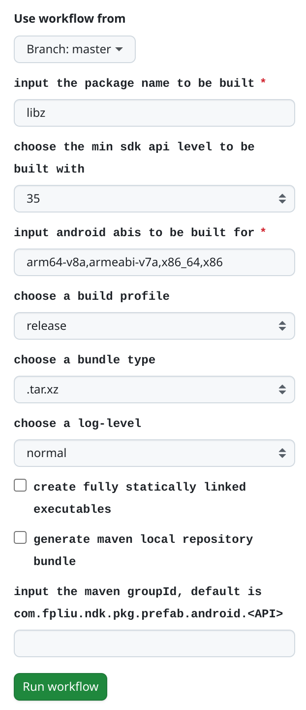

# ndk-pkg-package-manually-build

manually build [ndk-pkg](https://github.com/leleliu008/ndk-pkg) packages via GitHub Actions.

This is the recommended way of using [ndk-pkg](https://github.com/leleliu008/ndk-pkg).

In this way, you don't need to care about other things than:

- what package would you like to build?
- which minimum Android SDK API level would you like support?
- which Android ABI would you like to build for?
- which build type would you like to use?
- which link type would you like to use?

||
|-|
||

## how to use this project

**step1: fork this repository into your own github account**

**step2: manually run the GitHub Actions workflow to build a package**

Reference: <https://docs.github.com/en/actions/using-workflows/manually-running-a-workflow>

**step3: download the artifact**

Reference: <https://docs.github.com/en/actions/managing-workflow-runs/downloading-workflow-artifacts>
